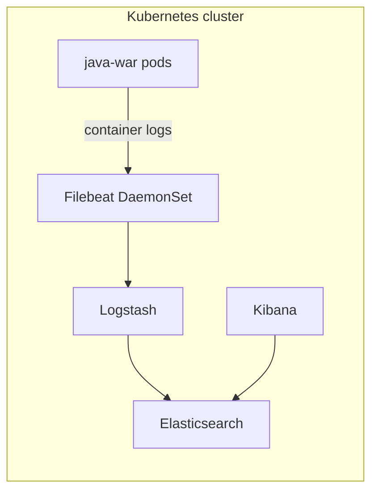
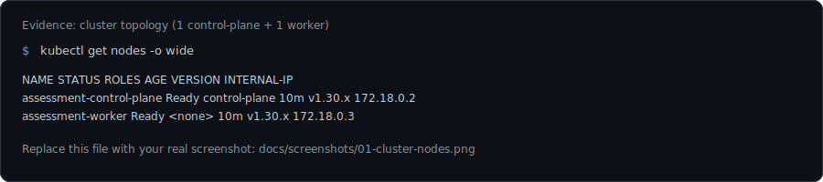

<div align="center">

# Assessment pack

**Java WAR on Tomcat · Kubernetes · Ingress / NodePort · ELK + Filebeat**

*Single repo with buildable app, container image, manifests, and a copy-paste runbook.*

[](https://kubernetes.io/)
[](https://www.docker.com/)
[](https://openjdk.org/)

</div>

---

## What you get

| Piece | Description |
|--------|-------------|
| **App** | Maven WAR with servlet `/api/ping` — logs structured lines (`event=ping`) to **stdout** |
| **Image** | Multi-stage `Dockerfile`: Maven build → Tomcat 9 (**`ROOT.war`** → served at **`/`**) |
| **Kubernetes** | `Deployment` + ClusterIP / NodePort / **Ingress** (`nginx`) in `demo` |
| **Observability** | Elasticsearch, Logstash, Kibana, Filebeat (**Filebeat → Logstash → ES**, index `logstash-*`) |



---

## Repository layout

```
assessment/
├── app/                 # WAR source (Maven)
├── docker/              # Dockerfile (Tomcat + ROOT.war)
├── docs/screenshots/    # Evidence gallery (example SVGs — swap for your PNGs)
├── k8s/
│   ├── app/             # namespace, deployment, services, ingress
│   └── elk/             # ES, Logstash, Kibana, Filebeat
├── kind-config.yaml     # kind: 1 control-plane + 1 worker + port maps
├── runbook/RUNBOOK.md   # Step-by-step: kind, ingress-nginx, curls, Kibana
└── README.md
```

---

## Screenshots (evidence gallery)

Use these as a **layout guide** for assessor-ready captures. The repo ships **illustrative SVGs** under [`docs/screenshots/`](docs/screenshots/); swap them for your own **PNG** (same filenames work in GitHub if you prefer raster) after you run the cluster.

| # | What to capture | Command / UI |
|---|-----------------|--------------|
| 1 | **Two Ready nodes** (control-plane + worker) | `kubectl get nodes -o wide` |
| 2 | **App exposure** (Deployment, Pods, Services, Ingress) | `kubectl -n demo get deploy,po,svc,ingress` |
| 3 | **Logs in Kibana** (`event=ping`, `java-war` filter) | Discover → data view `logstash-*` |

<p align="center">
  <br/>
  <sub><b>Fig. 1</b> — Cluster nodes (replace with your screenshot)</sub>
</p>

<p align="center">
  <br/>
  <sub><b>Fig. 2</b> — App workload &amp; networking</sub>
</p>

<p align="center">
  <br/>
  <sub><b>Fig. 3</b> — Kibana Discover (structured ping logs)</sub>
</p>

**Tip:** On Linux you can capture a window with your usual screenshot tool, or record terminal output to a file and paste into the assessment doc; for browser UI, a full-width **Discover** screenshot reads best.

---

## Prerequisites

- **Docker** (build + optional [kind](https://kind.sigs.k8s.io/) cluster)
- **kubectl** configured against your cluster
- For Ingress: **ingress-nginx** (or compatible) — see runbook for kind install snippet

---

## Quick start (local kind)

Full commands, ingress controller install, and troubleshooting live in **[`runbook/RUNBOOK.md`](runbook/RUNBOOK.md)**. TL;DR:

```bash
kind create cluster --name assessment --config kind-config.yaml
docker build -t java-war-demo:1.0.0 -f docker/Dockerfile .
kind load docker-image java-war-demo:1.0.0 --name assessment

kubectl apply -f k8s/app/namespace.yaml
kubectl apply -f k8s/app/
kubectl apply -f k8s/elk/namespace.yaml
kubectl apply -f k8s/elk/
```

**Access (default kind mapping in `kind-config.yaml`):**

- **NodePort:** `http://localhost:30080/` and `http://localhost:30080/api/ping?name=demo`
- **Ingress:** add `127.0.0.1 java.demo.local` to `/etc/hosts`, then `http://java.demo.local:8088/` (host **8088** → container 80 when port 80 is already in use on the host)

Label the control-plane node **`ingress-ready=true`** if the ingress controller stays Pending (see runbook).

---

## Build & image

```bash
cd app && ./mvnw -q -DskipTests package && ls -la target/java-war-demo.war
cd .. && docker build -t java-war-demo:1.0.0 -f docker/Dockerfile .
```

Push and re-tag if your cluster pulls from a registry; update `image:` in [`k8s/app/deployment.yaml`](k8s/app/deployment.yaml).

---

## Deploy app

```bash
kubectl apply -f k8s/app/namespace.yaml
kubectl apply -f k8s/app/
kubectl -n demo get deploy,po,svc,ingress -o wide
```

| Service | Role |
|---------|---------|
| `java-war-svc` | ClusterIP **:8080** |
| `java-war-svc-nodeport` | NodePort **30080** → app |
| `java-war-ingress` | Host **`java.demo.local`**, class **`nginx`** |

---

## ELK + Filebeat

```bash
kubectl apply -f k8s/elk/namespace.yaml
kubectl apply -f k8s/elk/
kubectl -n observability get pods
```

**Kibana:** `kubectl -n observability port-forward svc/kibana 5601:5601` → [http://localhost:5601](http://localhost:5601)

Create a data view **`logstash-*`** with time field **`@timestamp`**. In Discover, filter:

`kubernetes.labels.app : "java-war"`

---

## Generate traffic & verify

```bash
kubectl -n demo port-forward svc/java-war-svc 8080:8080
curl -sS "http://localhost:8080/api/ping?name=assessment"
kubectl -n demo logs deploy/java-war --tail=100
```

You should see Tomcat startup and **`event=ping`** lines from `PingServlet`.

---

## Cluster topology (assessment target)

The brief targets **one control-plane** and **one worker** — achievable with Rancher (RKE2 / k3s) or locally with **kind** using [`kind-config.yaml`](kind-config.yaml).

Evidence:

```bash
kubectl get nodes -o wide
```

---

## Notes & assumptions

| Topic | Detail |
|-------|--------|
| **Storage** | Elasticsearch uses dev-oriented sizing / `emptyDir` — fine for demos, not production |
| **Logs path** | Filebeat reads node **`/var/log/containers/*.log`** |
| **Indices** | Logstash writes **`logstash-YYYY.MM.dd`** |
| **Context path** | WAR is **`ROOT.war`** — app base path is **`/`**, not `/java-war-demo/` |

---

## Deliverables checklist

- [ ] Cluster: 2 nodes Ready (`kubectl get nodes`)
- [ ] Image built; pods Running (`kubectl -n demo get po`)
- [ ] Service + NodePort + Ingress documented / tested
- [ ] ELK + Filebeat applied; Kibana Discover shows **`java-war`** logs

For copy-paste evidence commands, use **[`runbook/RUNBOOK.md`](runbook/RUNBOOK.md)**.
